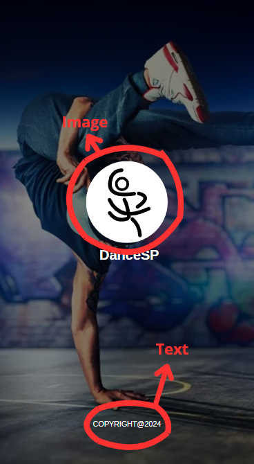
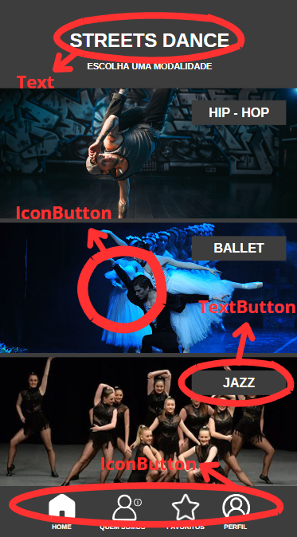
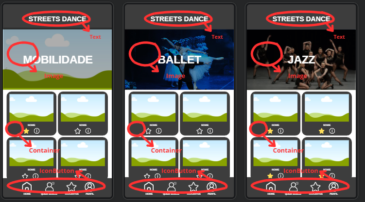
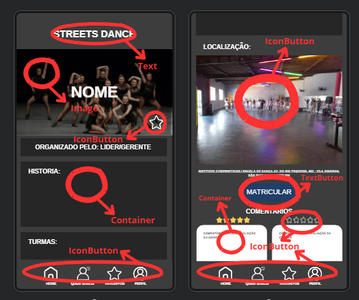
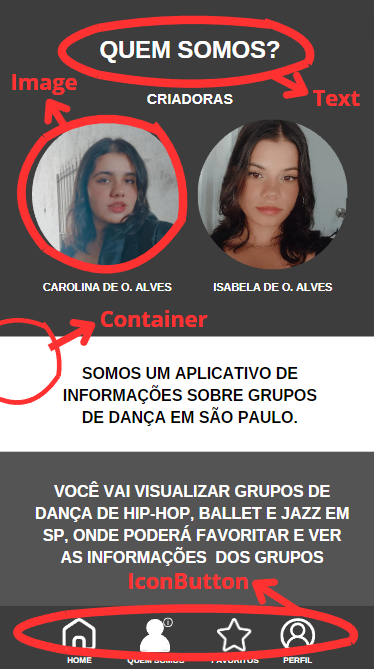
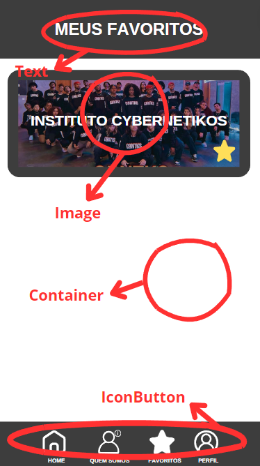
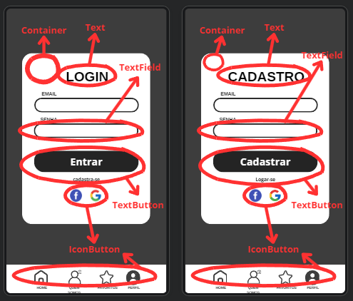
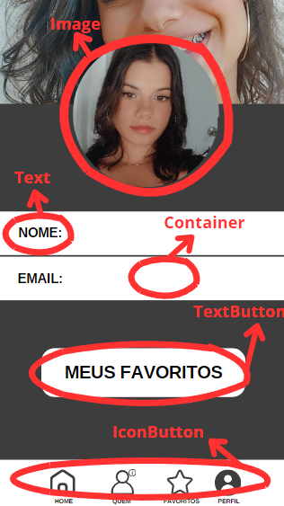

# APP-DanceSP
## descrição detalhada do APP e funções das telas e os recursos que serão aplicados 
## Quais são as telas estaticas e as dinamicas

# Tela Inicial

### Widgets - Inicial

**1 - Image:** É a implementação de uma imagem

**Parametro** 

    const Image(
      image: NetworkImage('https://flutter.github.io/assets-for-api-docs/assets/widgets/owl.jpg'),
    )

--------------------------------------------------------------------------------------------------

**2 - Text:** Implementação de Texto

**Parametro** 

    RichText(
        const TextSpan(text: 'texto'),)

# Tela Home

### Widgets - Home
**1 - TextButton:** Ultilizado como botão com um texto.

**Parametro** 

    TextButton(
        style: TextButton.styleFrom(
          primary: Colors.blue,
          ),
          onPressed: () { },
          child: Text('TextButton'),
    )

--------------------------------------------------------------------------------------------------

**2 - Text:** Implementação de Texto.

**Parametro** 

    RichText(
      const TextSpan(text: 'texto'),)

--------------------------------------------------------------------------------------------------

**3 - IconButton:** Ultilizado como botão com imagem.

**Parametro** 
 
    IconButton(
          splashRadius: 100,
          iconSize: 200,
          icon: Ink.image(
            image: const NetworkImage(
                'https://picsum.photos/250?image=9'),
    ),

        
# Tela modalidade Hip-Hop/Ballet/Jazz

### Widgets - Modalidades
**1 - Container:** Ultilizado para pintar uma parte especifica na tela.

**Parametro** 

    Container(
      color: Colors.black,
        child: Text('Container'),
    );

--------------------------------------------------------------------------------------------------

**2 - Image:** É a implementação de uma imagem.

**Parametro** 

    const Image(
      image: NetworkImage('https://flutter.github.io/assets-for-api-docs/assets/widgets/owl.jpg'),
      )

--------------------------------------------------------------------------------------------------

**3 - IconButton:** Ultilizado como botão com imagem.

**Parametro -** 

    IconButton(
          splashRadius: 100,
          iconSize: 200,
          icon: Ink.image(
            image: const NetworkImage(
                'https://picsum.photos/250?image=9'),
          ),

--------------------------------------------------------------------------------------------------

**4 - Text:** Implementação de Texto.

**Parametro** 

    RichText(
      const TextSpan(text: 'texto'),)

# Tela do grupo de dança

### Widgets - Telas do grupo.
**1 - Container:** Ultilizado para pintar uma parte especifica na tela.

**Parametro** 

    Container(
        color: Colors.black,
        child: Text('Container'),
    );

--------------------------------------------------------------------------------------------------

**2 - Image:** É a implementação de uma imagem.

**Parametro** 

    const Image(
      image: NetworkImage('https://flutter.github.io/assets-for-api-docs/assets/widgets/owl.jpg'),
    )

--------------------------------------------------------------------------------------------------

**3 - Text:** Implementação de Texto.

**Parametro** 

    RichText(
      const TextSpan(text: 'texto'),)

--------------------------------------------------------------------------------------------------

**4 - TextButton:** Ultilizado como botão com um texto.

**Parametro** 

    TextButton(
        style: TextButton.styleFrom(
          primary: Colors.blue,
          ),
          onPressed: () { },
          child: Text('TextButton'),
    )

--------------------------------------------------------------------------------------------------

**5 - IconButton:** Ultilizado como botão com imagem.

**Parametro -** 

    IconButton(
          splashRadius: 100,
          iconSize: 200,
          icon: Ink.image(
            image: const NetworkImage(
                'https://picsum.photos/250?image=9'),
          ),

# Tela QuemSomos

### Widgets - Quem Somos
**1 - Container:** Ultilizado para pintar uma parte especifica na tela.

**Parametro** 

    Container(
        color: Colors.black,
        child: Text('Container'),
    );

--------------------------------------------------------------------------------------------------

**2 - Image:** É a implementação de uma imagem.

**Parametro** 

    const Image(
      image: NetworkImage('https://flutter.github.io/assets-for-api-docs/assets/widgets/owl.jpg'),
    )

--------------------------------------------------------------------------------------------------

**3 - Text:** Implementação de Texto.

**Parametro** 

    RichText(
      const TextSpan(text: 'texto'),)

--------------------------------------------------------------------------------------------------

**4 - IconButton:** Ultilizado como botão com imagem.

**Parametro -** 

    IconButton(
          splashRadius: 100,
          iconSize: 200,
          icon: Ink.image(
            image: const NetworkImage(
                'https://picsum.photos/250?image=9'),
          ),

# Tela Favoritos

### Widgets - Favoritos
**1 - IconButton:** Ultilizado como botão com imagem.

**Parametro -** 

    IconButton(
          splashRadius: 100,
          iconSize: 200,
          icon: Ink.image(
            image: const NetworkImage(
                'https://picsum.photos/250?image=9'),
          ),

  --------------------------------------------------------------------------------------------------

**2 - Text:** Implementação de Texto.

**Parametro** 

    RichText(
      const TextSpan(text: 'texto'),)

--------------------------------------------------------------------------------------------------

**3 - Image:** É a implementação de uma imagem.

**Parametro** 

    const Image(
      image: NetworkImage('https://flutter.github.io/assets-for-api-docs/assets/widgets/owl.jpg'),
    )

--------------------------------------------------------------------------------------------------

**4 - Container:** Ultilizado para pintar uma parte especifica na tela.

**Parametro** 

    Container(
        color: Colors.black,
        child: Text('Container'),
    );

# Tela de Cadastro/Login

### Widgets - Login/Cadastro

**1 - Container:** Ultilizado para pintar uma parte especifica na tela.

**Parametro** 

    Container(
        color: Colors.black,
        child: Text('Container'),
    );

 --------------------------------------------------------------------------------------------------

**2 - TextField:** Caixa de texto.

**Parametro** 

    TextField(
      decoration: InputDecoration(
          border: OutlineInputBorder(),
        hintText: 'Enter a search term',
    ),
),

 --------------------------------------------------------------------------------------------------

**3 - IconButton:** Ultilizado como botão com imagem.

**Parametro -** 

    IconButton(
          splashRadius: 100,
          iconSize: 200,
          icon: Ink.image(
            image: const NetworkImage(
                'https://picsum.photos/250?image=9'),
          ),

  --------------------------------------------------------------------------------------------------

**4 - Text:** Implementação de Texto.

**Parametro** 

    RichText(
      const TextSpan(text: 'texto'),)

--------------------------------------------------------------------------------------------------

**5 - TextButton:** Ultilizado como botão com um texto.

**Parametro** 

    TextButton(
        style: TextButton.styleFrom(
          primary: Colors.blue,
          ),
          onPressed: () { },
          child: Text('TextButton'),
    )

# Tela de Perfil

### Widgets - Perfil

**1 - TextButton:** Ultilizado como botão com um texto.

**Parametro** 

    TextButton(
        style: TextButton.styleFrom(
          primary: Colors.blue,
          ),
          onPressed: () { },
          child: Text('TextButton'),
    )

  --------------------------------------------------------------------------------------------------

**2 - Text:** Implementação de Texto.

**Parametro** 

    RichText(
      const TextSpan(text: 'texto'),)

--------------------------------------------------------------------------------------------------

**3 - IconButton:** Ultilizado como botão com imagem.

**Parametro -** 

    IconButton(
          splashRadius: 100,
          iconSize: 200,
          icon: Ink.image(
            image: const NetworkImage(
                'https://picsum.photos/250?image=9'),
          ),
          
--------------------------------------------------------------------------------------------------

**4 - Container:** Ultilizado para pintar uma parte especifica na tela.

**Parametro** 

    Container(
        color: Colors.black,
        child: Text('Container'),
    );

--------------------------------------------------------------------------------------------------

**5 - Image:** É a implementação de uma imagem.

**Parametro** 

    const Image(
      image: NetworkImage('https://flutter.github.io/assets-for-api-docs/assets/widgets/owl.jpg'),
      )
